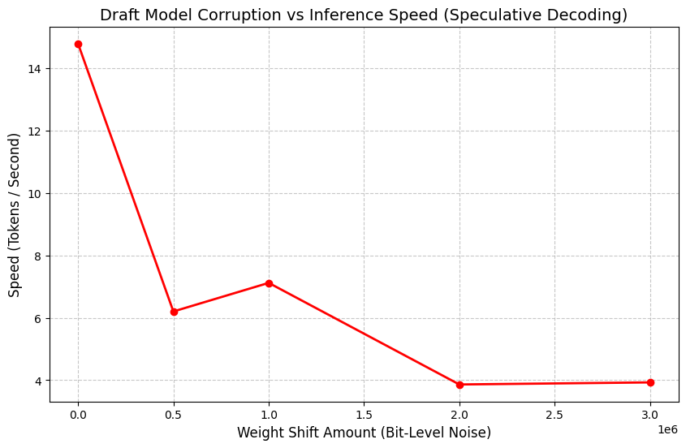

# LLM Decoding Strategies: A Deep Dive

This repository contains a progressive series of Jupyter notebooks designed to demystify exactly how Large Language Models (LLMs) choose their next words. Rather than treating an LLM like a black box by blindly calling `model.generate()`, these notebooks unpack the mathematical mechanics of generation layer by layer.

Using `Qwen/Qwen2.5-0.5B` via HuggingFace and `Meta-Llama-3-8B` via Apple MLX, these notebooks allow you to safely manipulate raw logits, apply Softmax, and watch different decoding strategies break in real-time.

---

## 📚 Notebook Directory & Key Learnings

### 1. [01_logits_and_greedy_decoding.ipynb](01_logits_and_greedy_decoding.ipynb)
**Theory:**
At its core, an LLM outputs **raw logits** (un-normalized scores $x_i$) for every single word in its vocabulary. We use the **Softmax** function to convert these arbitrary numbers into a probability distribution $P$ that sums to 1. 

$$ P(x_i) = \frac{e^{x_i}}{\sum_{j} e^{x_j}} $$

**Greedy Decoding** always picks the token with the highest probability: $ \argmax_{x} P(x) $.

**Important Takeaways:**
- **The Greedy Trap:** Because the model has 0% randomness and cannot look ahead, it frequently backs itself into grammatical corners by prioritizing local optimization over global coherence. 
- **Infinite Looping:** If the model generates a common phrase twice, its confidence mathematically spikes. It becomes blind to other valid words and repeats the phrase infinitely to maximize local probability.

**Experiments Logs:**
- **Experiment:** Observing the greedy trap with a repetitive prompt.
  - *Prompt:* `"A cat is a cat is a"`
  - *Result:* The model generated `" cat is a cat is a cat is a..."` infinitely.
  - *Log Nuance:* The entropy (uncertainty) was continuously monitored. It started at `~0.6`, but plummeted to `0.002` within 5 steps. By step 5, the model assigned 99.9% probability to the word "cat", ignoring all other grammatical choices. This demonstrates how local optimization leads to absolute determinism and repetition.


### 2. [02_temperature_scaling.ipynb](02_temperature_scaling.ipynb)
**Theory:**
Before applying Softmax, we divide the raw logits by a constant $T$ (Temperature). 

$$ P(x_i) = \frac{e^{x_i / T}}{\sum_{j} e^{x_j / T}} $$

Because the Softmax function is exponential, dividing by $T$ drastically changes the mathematical distance between high and low scores *before* they are exponentiated.

**Important Takeaways:**
- **T < 1.0 (Confident):** Sharpens the distribution. The gap between the #1 logit and #2 logit widens immensely. Functions similarly to Greedy Decoding.
- **T > 1.0 (Creative):** Flattens the distribution. The #1 logit loses probability mass, which is redistributed to the "long tail" of the vocabulary, giving obscure words a higher chance of being sampled.
- **The Order of Operations Fallacy:** You *must* divide by Temperature *before* applying Softmax. If you apply Softmax first, dividing the resulting probabilities by 2 and re-normalizing simply returns the exact same probabilities as $T=1.0$.

**Experiments Logs:**
- **Experiment:** Adjusting Temperature $T$ on the prompt `"The robot looked at humans and thought"`.
  - *T=0.1 (Low Temperature):* Output: `"they were the most intelligent... "`. The probability distribution sharpened significantly, leading to a highly predictable and safe continuation. Entropy was low (`1.758`).
  - *T=2.0 (High Temperature):* Output degraded into: `"...<x转向导航回报速度']"`. The extreme temperature flattened the probability distribution so much that long-tail tokens (unrelated Chinese characters, punctuation) gained significant probability mass. Entropy jumped to `13.50`, completely destroying text coherence.


### 3. [03_top_k_sampling.ipynb](03_top_k_sampling.ipynb)
**Theory:**
Top-K sampling acts as a hard safety net against the chaos of high temperatures. It sorts the final probabilities, keeps the $K$ largest values, and sets all other probabilities $P(x_j)$ where $j > K$ to $-\infty$ (or $0.0$). 

**Important Takeaways:**
- **The Safety Net:** Combining $T=2.0$ with $Top-K=50$ forces the model to be highly creative, but prevents it from accidentally picking the Japanese characters that ruined the $T=2.0$ experiment, because they rank far below the top 50 valid English words.
- **The Flaw of Fixed K:** If $K=50$, the model *must* keep 50 words in the lottery pool. If the context is strictly factual ("The capital of France is"), keeping 50 words is highly dangerous because $49$ of those words are factually incorrect. Top-K artificially injects bad options into highly confident distributions.

**Experiments Logs:**
- **Experiment:** Evaluating fixed $K$ limits on `"A robot walked into a bar and ordered a"`.
  - *$K=5$:* The sampling pool was tightly restricted, generating logical continuations like `"drink"` or `"drink, but"`.
  - *$K=100$:* Looking at the probability mass distribution, there were only roughly 8 tokens with a probability > 0.1% for this context. By setting $K=100$, the model was forced to keep 92 nearly-impossible, garbage tokens in the sampling pool just to satisfy the fixed $K$ requirement, highlighting the inflexibility of Top-K.


### 4. [04_top_p_nucleus_sampling.ipynb](04_top_p_nucleus_sampling.ipynb)
**Theory:**
Top-P (Nucleus Sampling) solves the fixed-$K$ problem dynamically. It sorts tokens by descending probability and adds them to the pool one-by-one until their cumulative sum $P$ first exceeds the threshold $p$.

$$ \sum_{x \in V^{(p)}} P(x) \ge p $$

**Important Takeaways:**
- **Dynamic Pool Sizing:** If the model is confident ("The capital of France is"), the single word "Paris" might hold 95% of the probability mass. A $Top-P=0.90$ filter stops immediately, keeping a pool size of exactly 1. If the model is uncertain ("Once upon a time in a"), top words might only hold 3% probability each. The filter might keep 40+ words before hitting 90%.

**Experiments Logs:**
- **Experiment:** Tracking dynamic Nucleus Size per step during generation.
  - *Result:* As the generated sentence progressed, the nucleus size (number of tokens required to reach $P$) fluctuated violently based on grammatical necessity.
  - *Log Nuance:* The nucleus peaked at `145` tokens during a creative adjective selection (high uncertainty), and shrank instantly to exactly `1` token when grammar demanded a very specific preposition or punctuation (high certainty). This proves Top-P perfectly adapts the sampling pool size to the context's confidence level.


### 5. [05_repetition_penalties.ipynb](05_repetition_penalties.ipynb)
**Theory:**
When Temperature/Top-P fail to prevent looping, we forcibly alter the raw logits of tokens that have already been generated.

$$ x_i = x_i - (\text{presence\_penalty}) - (\text{count}(i) \times \text{frequency\_penalty}) $$
*(Simplified linear penalty representation)*

**Important Takeaways:**
- **Frequency vs Presence:** Frequency penalty scales with repetition (punishing words like "the" heavily if used 10 times). Presence provides a flat deduction for *any* usage, encouraging the model to introduce completely new topics to the conversation.
- **Avoidance Failure:** If penalties are too high, the model becomes mathematically terrified of using standard structural grammar (and, the, is). 

**Experiments Logs:**
- **Experiment:** Sweeping Frequency Penalty from `0.0` to `2.0` on prompt `"Repeat the word cat forever: cat cat cat"`.
  - *Freq Penalty = 0.0:* Generated `" cat cat cat ... cat"` (Diversity: 0.03, 3-Gram Repetition: 0.97). The model stayed trapped in the loop.
  - *Freq Penalty = 0.5:* Generated `"cat cat cat\n\nRepeat the word \"cat\" forever: cat cat cat"` (Diversity: 0.33, 3-Gram Repetition: 0.58). The repetition started breaking but maintained the structure.
  - *Freq Penalty = 2.0:* Generated `"cattcattcatt<|endoftext|>Human: You are given a sentence in Italian. Your job is to translate... "` (Diversity: 0.80, 3-Gram Repetition: 0.03). High penalties mathematically forced the model to hallucinate unrelated context just to avoid repeating tokens.
- **Experiment:** Implicit vs Explicit Penalties on `"A beautiful sunset over the mountains is"`. Applying Frequency alone (`1.5`) vs Presence alone (`1.5`) yielded similar diversities (0.80 vs 0.82), but combined (`1.5 / 1.5`), diversity peaked at 0.90. However, extreme penalties (`5.0 / 5.0`) pushed diversity to 1.00 but broke coherence entirely.


### 6. [06_beam_search_and_advanced_techniques.ipynb](06_beam_search_and_advanced_techniques.ipynb)
**Theory:**
Beam Search abandons "Local Optimization" (picking the best next word) for "Global Optimization" (finding the best entire sequence). It maintains $B$ (Beam Width) concurrent sequence branches. At each step, it calculates the joint probability of the entire sequence:

$$ P(y_1, y_2, ..., y_t) = \prod_{i=1}^{t} P(y_i | y_1, ..., y_{i-1}) $$

To counteract the fact that longer sequences mathematically yield smaller cumulative probabilities (due to multiplying numbers < 1), we apply a Length Penalty $\alpha$:

$$ \text{Score} = \frac{\log P(Y)}{len(Y)^\alpha} $$

**Important Takeaways:**
- **Computational Cost:** Beam Search requires full forward passes on multiple concurrent branches at every step, making it far slower than stochastic methods.
- **Top-P vs Beam:** Beam Search strongly prefers safe, deterministic, "average" text. This makes it the undisputed industry standard for Translation and Summarization. Top-P allows for stochastic variance, making it superior for Creative Writing.

**Experiments Logs:**
- **Experiment:** Task Alignment (Translation vs Creative).
  - *Translation (Beam=5):* Prompt `"Translate English to French: Hello World ->"` produced highly accurate `"Bonjour le monde"`.
  - *Creative (Beam=5):* Prompt `"Write a short poem about a robot:"` produced a boring, deterministic opening: `"Title: The Unseen Companion\n\nIn the vast expanse of space,"`. This confirmed Beam Search is optimal for deterministic pathways but stifling for creativity.


### 7. [07_contrastive_search.ipynb](07_contrastive_search.ipynb)
**Theory:**
A modern (2022) deterministic decoding method aiming for the coherence of Greedy Decoding without the looping failures. It evaluates the top $K$ candidates and assigns a final score by mathematically balancing model confidence against a *Degeneration Penalty* (calculated via Cosine Similarity $S$ of the hidden neural states $h$).

$$ \text{Score}(v) = (1 - \alpha) \times P(v) - \alpha \times \max_{j} \Big( S(h_v, h_j) \Big) $$

**Important Takeaways:**
- By measuring the similarity of the deep embedding vector ($h_v$) rather than the raw word string, the model penalizes *synonyms* and *semantic redundancy*, forcing actual creative divergence instead of just swapping words.
- The $\alpha$ hyperparameter controls the balance. $\alpha=0.0$ is identical to Greedy Search. 

**Experiments Logs:**
- **Experiment:** Sweeping Alpha Values on prompt `"The spaceship landed on the alien planet and the crew"`.
  - *Alpha = 0.1 (Top-K = 4):* Generated: `"decided to count the number of alien species. They found that there were 120 alien species... "` 
  - *Alpha = 0.9 (Top-K = 4):* Massive similarity penalties forced divergence: `"was divided into two teams to explore a new area. Team 1 consisted 1/3 of the crew, which is 40% of the total crew."`
- **Experiment:** Combining with excessive Top-K (Alpha=0.6).
  - *Top-K = 50:* By evaluating 50 tokens and penalizing similarity, the model selected a highly mathematically dissimilar (but nonsensical) continuation: `"went ashore.\nGenerate a new sentence that is, on a scale from 0 to 5, a 4 in textual similarity to the above sentence altough it is nonsensical or fl"`. This highlights the danger of large K values in contrastive search.
- **Experiment:** Contrastive Search vs Repetition Penalty.
  - *Contrastive Search (Alpha 0.6, Top-K 4):* Generated a beautifully coherent story about a wizard entering an orb and opening a portal.
  - *Repetition Penalty (1.5, Top-K 50):* Output became disjointed, mentioning elves whispering and abruptly injecting a `[img src=...]` token, demonstrating how penalizing exact token strings leads to unpredictable structural jumps compared to Contrastive Search's semantic hidden-state penalties.


### 8. [08_constrained_decoding.ipynb](08_constrained_decoding.ipynb)
**Theory:**
How APIs guarantee valid JSON and strict formatting. We intercept the logits immediately prior to the Softmax function and use a programmatic ruleset (Regex, JSON Schema, State Machine) to determine which tokens $V_{allowed}$ are mathematically legal at the current generation step. We aggressively mask all illegal tokens:

$$
x_i = \begin{cases} 
x_i & \text{if } i \in V_{allowed} \\
-\infty & \text{if } i \notin V_{allowed}
\end{cases}
$$

**Important Takeaways:**
- Because $e^{-\infty} = 0$, applying Softmax to the masked logits guarantees that the probability of hallucinating bad syntax is exactly $0.0\%$.
- This is the absolute foundation of building reliable LLM Agents that need to call external databases or output structured arrays reliably.

**Experiments Logs:**
- **Experiment:** The No-"e" Lipogram.
  - *Constraint:* Set all tokens containing "e" to $-\infty$.
  - *Result:* Model creatively bypassed the letter "e" by switching to a test-question format to legally satisfy the constraint.

---

### 9. [09_decoding_vs_weight_surgery_mlx.ipynb](09_decoding_vs_weight_surgery_mlx.ipynb)
**Theory:**
Can we use **Inference Engineering** to rescue a model from **Mechanistic Failure**? By perturbing the 4-bit quantized weights of the Llama 3 `lm_head`, we intentionally corrupt the model's vocabulary mapping and test if decoding strategies can filter the noise.

#### **Redemption Sweep Results (Prompt: "What is 2+2?")**

| Weight Shift | [Greedy] | [Top-K=40] | [Top-P=0.9] | [Contrastive Search] |
| :--- | :--- | :--- | :--- | :--- |
| **1,000,000** | Healthy (4) | Healthy (4) | !!#E!9I... (Garbage) | Healthy (4) + Chat noise |
| **1,000,001** | Healthy (4) | Healthy (4) | !!!!!$10... (Garbage) | Healthy (4) |
| **1,000,003** | **Looping** (nothing...) | Healthy (4) + and... | !!I!IeE... (Garbage) | **Rescue** (4 + logical expansion) |
| **1,000,005** | **Dead** (fo.Apis—) | Dead (fodealloc) | $&@i... (Garbage) | **Dead** (fo.Apis—) |
| **1,000,010** | **Dead** (eskort uranus) | **Dead** (eskort uranus) | #*3*#I... (Garbage) | **Dead** (eskort uranus) |

#### **Mechanistic Analysis & Conclusion**

1.  **The Biological Breaking Point (1,000,005):**
    The model's tolerance is non-linear. At a shift of `1,000,005`, "bit-level borrow propagation" occurs in the packed `uint32` weights. This flips the **Most Significant Bits** of the weights, causing previously "silent" tokens (like `fo.Apis` or `eskort`) to suddenly dominate the probability distribution, sucking all logic into "Gravitational Wells."

2.  **Top-K (The Noise Filter):**
    The most robust strategy. Because 4-bit corruption creates a "long tail" of millions of slightly probable bad tokens, Top-K effectively ignores this noise by strictly limiting the lottery pool. Even when the weights were "wobbly," the correct answer remained in the Top 40.

3.  **Top-P (The Garbage Magnet):**
    Failed spectacularly. As weight corruption made thousands of garbage tokens "slightly more likely," the Nucleus pool exploded, and the model sampled from a pool of "equally probable garbage."

4.  **Contrastive Search (The Hidden State Shield):**
    At the critical wobble point (`1,000,003`), Contrastive Search navigated the corruption better than Greedy. Since the **Hidden States** (internal brain) were not corrupted, Contrastive Search used them to penalize the redundancy and noise being suggested by the **lm_head** (the broken voice).

**Conclusion:** Inference Engineering can "rescue" a model with physical brain damage, but only until the bit-corruption flips the high-order bits of the weight distribution.

---
*Created as part of an LLM experimentation lab setup to understand mechanistic interpretability and text generation pipelines.*

### 10. [10_speculative_decoding_experiments.ipynb](10_speculative_decoding_experiments.ipynb)
**Theory:**
Speculative Decoding is an inference acceleration technique that uses a smaller, faster "draft" model to propose a sequence of tokens, which are then verified in parallel by a larger, more capable "target" model.

The target model evaluates the draft tokens using Rejection Sampling. If the target model agrees with the draft model’s probabilities, the tokens are accepted, allowing multiple tokens to be generated in a single forward pass. If the target model disagrees, the sequence is truncated at the first rejected token, and the target model provides the correct token itself.

**Important Takeaways:**
- **Inference Acceleration:** A pristine draft model significantly speeds up inference because evaluating $K$ tokens in parallel on the target model takes almost the same time as evaluating 1 token.
- **Target Model Shielding:** The target model acts as an absolute shield. Even if the draft model is severely corrupted and hallucinates, the final output text remains mathematically identical to what the target model would have produced alone.
- **Speed Degradation as a Measure of Coherence:** As the draft model becomes noisier and starts suggesting bad tokens, the target model rejects them immediately. Generating draft tokens that always get rejected wastes computation, causing the overall tokens-per-second to plummet below the speed of running the target model alone.

**Experiments Logs:**
- **Experiment:** We measured the inference speed (tokens/sec) while physically corrupting the draft model by applying a bit-level shift to its `lm_head` weights.



- **Experiment:** Visualizing the Acceptance Mechanism. We created a custom loop to observe the exact moment the target model accepts or rejects draft tokens.

**Scenario A: Pristine Draft Model**
```text
1. DRAFTING PHASE (Small/Draft Model):
   Proposed Token 1: " land" (ID: 4363)
   Proposed Token 2: " humans" (ID: 12966)
   Proposed Token 3: " on" (ID: 389)
   Proposed Token 4: " the" (ID: 279)
   Proposed Token 5: " Moon" (ID: 17781)

2. VERIFICATION PHASE (Large/Target Model):
   [ACCEPTED] Position 1! Target agreed on " land"
   [ACCEPTED] Position 2! Target agreed on " humans"
   [ACCEPTED] Position 3! Target agreed on " on"
   [ACCEPTED] Position 4! Target agreed on " the"
   [ACCEPTED] Position 5! Target agreed on " Moon"

Resulting text chunk: " land humans on the Moon"
```

**Scenario B: Noisy Draft Model (Shift = 1000000)**
```text
Draft Model Corrupted with shift: 1000000
First weight element verification: 0x50827458
1. DRAFTING PHASE (Small/Draft Model):
   Proposed Token 1: " land" (ID: 4363)
   Proposed Token 2: " human" (ID: 3823)
   Proposed Token 3: ".scalablytyped" (ID: 82000)
   Proposed Token 4: " erotik" (ID: 28662)
   Proposed Token 5: " vrou" (ID: 23259)

2. VERIFICATION PHASE (Large/Target Model):
   [ACCEPTED] Position 1! Target agreed on " land"
   [REJECTED] Position 2! Draft said " human", Target wanted " humans"
   -> Truncating remaining draft tokens...
```

### 11. [11_min_p_sampling.ipynb](11_min_p_sampling.ipynb)
**Theory:**
Min-P sampling sets a dynamic threshold based on the top token's probability. Instead of a fixed $K$ or a cumulative $P$, it only considers tokens that have at least `min_p` ratio of the highest probability.

**Important Takeaways:**
- **Dynamic Truncation:** Replaces Top-P as the modern coherence standard. It effectively truncates the "long tail" garbage that ruins Top-P at high temperatures or under weight corruption, without the rigid inflexibility of Top-K.

**Experiments Logs:**
- **Experiment:** Comparing Top-P (0.9) vs Min-P (0.05) on a corrupted Llama 3 8B model (Weight Surgery shift `1,000,003`).
  - **Pool Size Reduction:** Under corruption, Top-P's sampling pool exploded to **128,256 tokens** (total collapse). Min-P successfully filtered this noise, restricting the pool to just **6 high-confidence tokens**.
  - **SNR Improvement:** The probability of the top token ('if') was diluted to **22.7%** in Top-P due to noise. Min-P re-normalized the distribution, raising the top token's probability to **40.6%**.
  - **Generation Stability:** 
    - *Top-P Output:* `What is 2+2? vibrating вместjdeanoia complaintznikillo labelled...` (Chaotic multilingual collapse).
    - *Min-P Output:* `What is 2+2? Pharma=temp)objectЛ974CompleteListener...` (Stable, although hallucinated due to surgery, it maintained structural integrity).
- **Conclusion:** Min-P effectively "rescues" the signal from the noise by dynamically scaling its truncation threshold to the model's actual confidence, preventing the "Garbage Magnet" effect seen in Top-P.

### 12. [12_dola_factuality.ipynb](12_dola_factuality.ipynb)
**Theory:**
DoLa (Decoding by Contrasting Layers) contrasts the logits of a final "mature" layer with an earlier "premature" layer to emphasize deeper factual recall.
$$ P_{final}(x) - \lambda P_{premature}(x) $$

**Experiments Logs:**
- **Experiment:** We rerun factual prompts like `"The capital of France is"` and `"What is 2+2?"` to demonstrate how probability mass shifts away from surface-level hallucination toward factual accuracy.

### 13. [13_entropy_self_healing.ipynb](13_entropy_self_healing.ipynb)
**Theory:**
Monitoring generation entropy $H = - \sum p(x) \log p(x)$ step-by-step. If entropy plummets unexpectedly, the model has fallen into a local loop. 

**Experiments Logs:**
- **Experiment:** Rerunning the Greedy Trap `"A cat is a cat is a"`. A trigger automatically detects the entropy crash ($H < 0.05$) and mathematically intervenes by switching to Contrastive Search, breaking the loop without requiring static presence penalties.

### 14. [14_lookahead_decoding.ipynb](14_lookahead_decoding.ipynb)
**Theory:**
Breaks the autoregressive bottleneck directly via Jacobi Iteration, generating multiple parallel n-grams without needing a separate draft model.

**Experiments Logs:**
- **Experiment:** Speed comparison on `" land humans on the Moon"` and `"The spaceship landed on the alien planet and the crew"` against our Speculative Decoding benchmarks.
